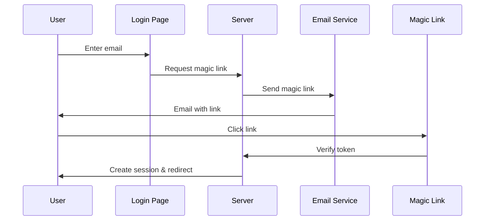

# Authentication Guide

Totolaw uses **passwordless authentication** with magic links powered by Better Auth. This provides a secure, user-friendly login experience without the need for passwords.

## Overview

### Why Magic Links?

- 🔐 **More Secure** - No password to steal or forget
- ✉️ **Email Verification** - Inherently verifies email ownership
- 🚀 **Better UX** - One-click login from email
- 🛡️ **Reduced Attack Surface** - No password databases to breach
- 📱 **Mobile Friendly** - Easy login from any device

### How It Works



1. User enters their email address
2. System generates a unique, time-limited token
3. Magic link with token is sent to user's email
4. User clicks the link
5. Server validates token and creates session
6. User is logged in and redirected to dashboard

## Configuration

### Environment Variables

Required variables in `.env.local`:

```env
# Auth Configuration
BETTER_AUTH_URL=http://localhost:3441
BETTER_AUTH_SECRET=your-secret-key-here
NEXT_PUBLIC_APP_URL=http://localhost:3441

# Email/SMTP Configuration
SMTP_HOST=smtp.gmail.com
SMTP_PORT=465
SMTP_USER=your-email@gmail.com
SMTP_PASS=your-app-password
```

### Generating Auth Secret

Generate a secure secret key:

```bash
openssl rand -base64 32
```

This creates a cryptographically secure random string for session encryption.

### Better Auth Setup

The auth configuration is in `lib/auth.ts`:

```typescript
export const auth = betterAuth({
  secret: authSecret,
  url: authUrl,
  database: drizzleAdapter(db, {
    provider: "pg",
    schema: {
      user: schema.user,
      session: schema.session,
      account: schema.account,
      verification: schema.verification,
    },
  }),
  plugins: [
    magicLink({
      sendMagicLink: async ({ email, token, url }) => {
        await sendEmail(email, "Your Magic Login Link", [
          `Bula vinaka,`,
          `You requested a magic login link.`,
          `<a href="${url}">Click Here to Login</a>`,
        ]);
      },
      rateLimit: {
        window: 15 * 60 * 1000, // 15 minutes
        max: 5, // 5 requests per window
      },
    }),
    nextCookies(),
  ],
  trustedOrigins: [
    process.env.NEXT_PUBLIC_APP_URL,
    "https://totolaw.org",
  ],
});
```

## Authentication Flow

### 1. Login Page (`app/auth/login/page.tsx`)

The login page provides a simple email input form:

```typescript
const { signIn } = authClient;

await signIn.magicLink({
  email,
  callbackURL: "/dashboard",
});
```

**Features:**
- Email validation
- Loading states
- Error handling
- Redirect after sending

### 2. Magic Link Verification (`app/auth/magic-link/page.tsx`)

When users click the magic link, they're directed to this page which:

1. Extracts the token from the URL
2. Verifies the token with Better Auth
3. Creates a session if valid
4. Redirects to the dashboard
5. Shows errors if token is invalid/expired

### 3. Session Management

Sessions are managed automatically by Better Auth:

- **Storage**: HTTP-only cookies (secure)
- **Duration**: Configurable (default: 7 days)
- **Refresh**: Automatic session refresh
- **Revocation**: Logout clears session

### 4. Protected Routes

The dashboard and other protected pages check authentication:

```typescript
useEffect(() => {
  const checkSession = async () => {
    const session = await authClient.getSession();
    
    if (!session?.data?.user) {
      router.push("/auth/login");
      return;
    }
    
    setUser(session.data.user);
  };
  
  checkSession();
}, [router]);
```

## Email Service

### Configuration (`lib/services/email.service.ts`)

The email service uses Nodemailer to send magic links:

```typescript
export async function sendEmail(
  to: string,
  subject: string,
  messages: string[]
) {
  const transporter = nodemailer.createTransport({
    host: process.env.SMTP_HOST,
    port: Number(process.env.SMTP_PORT),
    secure: true,
    auth: {
      user: process.env.SMTP_USER,
      pass: process.env.SMTP_PASS,
    },
  });

  await transporter.sendMail({
    from: process.env.SMTP_USER,
    to,
    subject,
    html: messages.join("<br><br>"),
  });
}
```

### Email Templates

Customize the magic link email in `lib/auth.ts`:

```typescript
sendMagicLink: async ({ email, token, url }) => {
  await sendEmail(email, "Your Magic Login Link", [
    `Bula vinaka,`, // Fijian greeting
    `You requested a magic login link.`,
    `<a href="${url}">Click Here to Login</a>`,
    `This link will expire in 15 minutes.`,
    `If you didn't request this, please ignore this email.`,
  ]);
}
```

### SMTP Providers

#### Gmail

1. Enable 2FA on your Google account
2. Generate an App Password
3. Use these settings:

```env
SMTP_HOST=smtp.gmail.com
SMTP_PORT=465
SMTP_USER=your-email@gmail.com
SMTP_PASS=your-16-char-app-password
```

#### SendGrid

```env
SMTP_HOST=smtp.sendgrid.net
SMTP_PORT=465
SMTP_USER=apikey
SMTP_PASS=your-sendgrid-api-key
```

#### Mailgun

```env
SMTP_HOST=smtp.mailgun.org
SMTP_PORT=465
SMTP_USER=postmaster@yourdomain.com
SMTP_PASS=your-mailgun-smtp-password
```

#### Amazon SES

```env
SMTP_HOST=email-smtp.us-east-1.amazonaws.com
SMTP_PORT=465
SMTP_USER=your-smtp-username
SMTP_PASS=your-smtp-password
```

## Security Features

### Rate Limiting

Magic link requests are rate-limited to prevent abuse:

```typescript
rateLimit: {
  window: 15 * 60 * 1000, // 15-minute window
  max: 5, // Max 5 requests per window
}
```

This prevents:
- Email bombing
- Token enumeration attacks
- Service abuse

### Token Expiration

Magic link tokens expire after a set time (default: 15 minutes):

- Reduces window for token theft
- Encourages timely login
- Automatic cleanup of old tokens

### CSRF Protection

Better Auth includes built-in CSRF protection:

- Validates request origins
- Uses secure headers
- Prevents cross-site attacks

### Secure Cookies

Sessions use HTTP-only cookies:

- Not accessible via JavaScript
- Automatically sent with requests
- Secure flag for HTTPS
- SameSite protection

## Database Schema

Better Auth creates these tables:

### `user` Table

```typescript
{
  id: string (primary key)
  name: string | null
  email: string (unique)
  emailVerified: boolean
  image: string | null
  createdAt: timestamp
  updatedAt: timestamp
}
```

### `session` Table

```typescript
{
  id: string (primary key)
  userId: string (foreign key)
  expiresAt: timestamp
  token: string
  ipAddress: string | null
  userAgent: string | null
}
```

### `account` Table

```typescript
{
  id: string (primary key)
  userId: string (foreign key)
  accountId: string
  providerId: string
  accessToken: string | null
  refreshToken: string | null
  expiresAt: timestamp | null
}
```

### `verification` Table

```typescript
{
  id: string (primary key)
  identifier: string (email)
  value: string (token)
  expiresAt: timestamp
  createdAt: timestamp
}
```

## API Routes

### `POST /api/auth/sign-in/magic-link`

Request a magic link:

**Request:**
```json
{
  "email": "user@example.com",
  "callbackURL": "/dashboard"
}
```

**Response:**
```json
{
  "success": true,
  "message": "Magic link sent"
}
```

### `GET /api/auth/magic-link/verify`

Verify magic link token:

**Query Parameters:**
- `token`: The magic link token

**Response:**
- Sets session cookie
- Redirects to callback URL

### `POST /api/auth/sign-out`

Sign out current user:

**Response:**
```json
{
  "success": true
}
```

## Client-Side Usage

### Auth Client (`lib/auth-client.ts`)

```typescript
import { authClient } from "@/lib/auth-client";

// Sign in
await authClient.signIn.magicLink({
  email: "user@example.com",
  callbackURL: "/dashboard",
});

// Get session
const session = await authClient.getSession();

// Sign out
await authClient.signOut();
```

### React Hooks

Check authentication in components:

```typescript
const [user, setUser] = useState(null);

useEffect(() => {
  authClient.getSession().then((session) => {
    setUser(session?.data?.user);
  });
}, []);
```

## Troubleshooting

### Magic Links Not Arriving

1. **Check SMTP credentials** - Verify `.env.local` settings
2. **Check spam folder** - Magic links may be filtered
3. **Review server logs** - Look for email errors
4. **Test SMTP connection** - Send a test email
5. **Check rate limits** - Wait 15 minutes and retry

### Token Verification Fails

1. **Token expired** - Request a new magic link
2. **Token already used** - Each token is single-use
3. **URL mismatch** - Ensure `BETTER_AUTH_URL` is correct
4. **Database issue** - Check database connection

### Session Not Persisting

1. **Cookies disabled** - Enable cookies in browser
2. **Domain mismatch** - Check cookie domain settings
3. **HTTPS issues** - Use HTTPS in production
4. **Secret mismatch** - Verify `BETTER_AUTH_SECRET`

### Rate Limit Errors

Wait 15 minutes or adjust rate limits in `lib/auth.ts`:

```typescript
rateLimit: {
  window: 15 * 60 * 1000, // Increase window
  max: 10, // Increase max requests
}
```

## Production Checklist

Before deploying to production:

- [ ] Generate strong `BETTER_AUTH_SECRET`
- [ ] Use HTTPS for `BETTER_AUTH_URL`
- [ ] Configure reliable SMTP provider
- [ ] Set up email sending monitoring
- [ ] Test magic link flow thoroughly
- [ ] Configure proper CORS settings
- [ ] Enable production logging
- [ ] Set up session monitoring
- [ ] Configure backup SMTP provider
- [ ] Test rate limiting behavior

## Best Practices

1. **Email Deliverability**
   - Use dedicated SMTP service
   - Configure SPF/DKIM/DMARC records
   - Monitor bounce rates
   - Use branded from address

2. **User Experience**
   - Clear instructions on login page
   - Show loading states
   - Handle errors gracefully
   - Provide support contact

3. **Security**
   - Keep Better Auth updated
   - Monitor failed login attempts
   - Log security events
   - Regular security audits

4. **Performance**
   - Cache email templates
   - Use queue for email sending
   - Monitor SMTP performance
   - Set appropriate timeouts

## Additional Resources

- [Better Auth Documentation](https://www.better-auth.com)
- [Magic Link Plugin](https://www.better-auth.com/docs/plugins/magic-link)
- [Drizzle ORM](https://orm.drizzle.team)
- [Next.js Authentication](https://nextjs.org/docs/authentication)

---

**Secure, Simple, Passwordless. Welcome to the future of authentication! 🔐**
